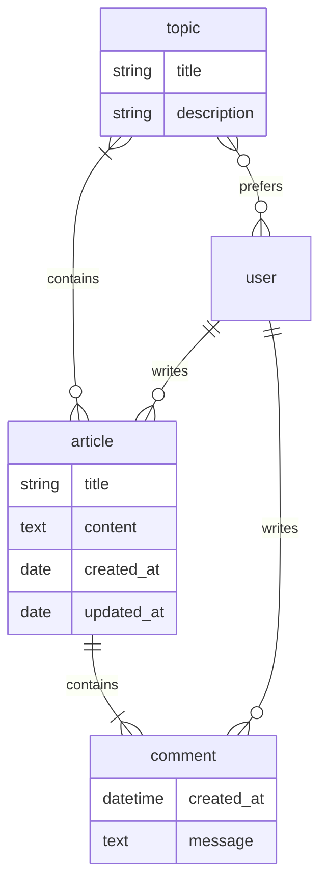

# Blog Site

The project aims to develop a robust and user-friendly web application using
the Django framework. The primary goal is to create a blogging platform that
allows users to publish and manage articles on various topics. The application
will provide an intuitive interface for authors to compose and format their
articles, while also offering a seamless reading experience for visitors.

## Key Features

### User Registration and Authentication

The application will provide user registration and authentication
functionality, allowing individuals to create accounts, log in, and manage
their profile information. This feature will enable authors to have
personalized accounts and maintain ownership of their published articles.

### Article Management

Authors will be able to create, edit, and delete articles within the
application. The system will offer a user-friendly editor. Additionally,
authors will be able to categorize articles by assigning relevant topics to
them.

### Topic Subscription

The application will include a subscription feature that allows users to
subscribe to topics of interest. By subscribing to specific topics, users will
receive notifications or updates whenever new articles are published in those
categories. This feature will enhance user engagement and ensure that readers
stay informed about the topics they find most valuable.

Overall, the project aims to deliver an efficient blogging platform that caters
to both authors and readers. By providing a seamless user experience and
incorporating essential functionalities such as user authentication, article
management, and topic subscriptions, the application will empower users to
create, share, and explore engaging content within a well-structured and
organized platform.

Here is a starter repository template that may help:
[Starter template](https://github.com/devsforge/django-tpl.git).

## Challenge: Functional views

It's ok not to return **actual** content for now. Ensure all the routes are
available and provide correct data. Use anything you like to return within an
HTTP response.

- `/about/`: Provides a regular text for a user, describing the
  functionalities of the django site.
- `/`: A site's homepage. This will contain a list of blogs published
  via the django site.
- `/<article>/`: A single article detail view. The URL contains a dynamic part
  in it. This will be used to fetch a single article from the database.
- `/<article>/comment/`: This view will be used to add comments to an article.
- `/create/`: A article creation form.
- `/<article>/update/`: A view to update existing article data.
- `/<article>/delete/`: A view to confirm article deletion.
- `/topics/`: A list of topics available on the site.
- `/topics/<topic>/add/`: Add the selected topic to the preferred topics list.
- `/topics/<topic>/remove/`: Removes the selected topic from preferred.
- `/topics/<topic>/subscribe/`: A view to subscribe for a topic.
- `/topics/<topic>/unsubscribe/`: A view to unsubscribe from a topic.
- `/profile/<str:username>/`: A site user's personal page.
- `/set-password/`: This route will be used to change users' credential data.
- `/set-userdata/`: This route will be user to change users' data.
- `/deactivate/`: Account deactivation (deletion) view.
- `/register/`: This view contains a user registration form.
- `/login/`: This view contains a login form.
- `/logout/`: Logout page. This view should redirect the user back to the
  homepage.

> [!WARNING]
> Optional task(s)
>
> - `/archive/<int:year>/<int:month>/`: This view provides a list of articles
    published on a specified month of a specified year. This view should apply
    date validation and raise `Http404` for invalid paths. The valid date is a
    year's 4-digits form followed by one or two digits representing a month.
    Month range should be limited as [1..12], leading zero may be omitted.
    Valid URLs are:
>
>       /archive/2023/1/
>       /archive/2023/01/
>       /archive/2023/10/
>

## Challenge: Data models

> [!TIP] 
> Django admin may be used to create some fake data. To gather access to
> an admin section, you need to create a superuser. The easiest way to do that
> is to use a django command:
> 
> ``` shell
> python manage.py createsuperuser
> ```

**General**

- Each model will be registered for the admin site.

**Article topic**

- This is a simple model that contains information about a topic:
    - topic title (unique value, 64 characters or fewer)
    - topic short description (255 characters or fewer)

**Article**

- Article requires title (255 characters or fewer).
- Article requires content (at least 255 characters).
- Creation date should be autogenerated at article creation and would
  never be updated.
- Updated date will be updated at each article saved.

**Article comment**

- Comment requires creation date (autogenerated).
- Comment requires message text.

**Relationships**

> [!NOTE] 
> The standard Django user model **will be** used for now. To apply model
> reference pass `"auth.User"` as a related model. Users can be created via
> admin page. You can also refer to the same model as shown below:
> 
> ``` python
> from django.contrib.auth import get_user_model
> from django.conf import settings
> 
> UserModel = get_user_model()          # option 1
> UserModel = settings.AUTH_USER_MODEL  # option 2
> UserModel = "auth.User"               # option 3
> ```

- `article` and `topics` have *many-to-many* relationship.
- `article` and `user` have *one-to-many* relationship. An article can have *
  *only one** author, but users can create as many articles as they want.
- `article` and `comment` have *one-to-many* relationship. An article may be a
  container for many comments, but a comment is related to a single article.
- `comment` and `user` have *one-to-many* relationship. It's similar to the
  *article-user* relationship.
- `topic` and `user` use *many-to-many* relationship. A single user can prefer
  none or as many topics as needed and vice versa. This relationship represents
  topics preferred by a certain blog user. Also, this provides an additional
  option to mark some of the preferred topics with a **notify** flag to receive
  newsletters about specified topics updates. The difference between *prefer*
  and *notify* is that *preferred* topics affect the article list for a user,
  and *notify* is responsible for newsletters for the user.

**UML diagram**



## Challenge: ORM

Update existing views to represent entities that are actually stored inside the
project's database.

- `/`: should represent a list of existing articles.
- `/<article>/`: should represent a single existing article.
- Detail view should get a list of article-related comments.
- `/profile/<str:username>/`: should contain information about user and a list
  of articles authored by this user.
- All views related to a single entity (*detail*, *update*, *delete*,
  *profile*) should raise `Http404` in case entity could not be fetched.

> [!TIP]
> It's common to store dedicated functions/classes that supports some specific
> business logic in a separate module called `services.py` or `utils.py` within
> an application directory.

> [!WARNING]
> Optional task(s)
>
> - Create a service to fetch articles ordered by specified user preferences.
    This means, topics preferred by a user affect articles order. Queryset
    should be ordered in a way, to have articles with most corresponding topics
    at the begging. However, the publication date should be preferred over
    the topic.

## Challenge: Templates

> [!TIP]
> Helpful link:
> [Bootstrap template](https://github.com/devsforge/css-bootstrap-blog)

> [!IMPORTANT]
> Links related to user data **may be** placeholders for now.

**General**

- **All** templates should be inherited from the `base.html` template.
- Each page has a descriptive title HTML tag, which included `| Blog`
  suffix, e.g. "Articles | Blogs," "Sample | Blog," "Login | Blog" etc.
- Each page should contain a link to homepage (`/` URL route).
- Each page contains a list of registered topics. Each view of this kind
  filters only articles of a relevant topic. This should be implemented
  with a custom template context processor.
- Replace content block for *about* page with some static content.
- Application-level templates should be located within appropriate
  applications.

> [!WARNING]
> Optional task(s)
>
> - Each page should contain a list of links to archive views for the last year. 
> - Each page should contain an inclusion-block(s) with the following links:
>   - `/registration/`: new user registration form
>   - `/login/`: user login form
>   - `/create/`: article creation page

**Articles list**

- The main page contains a list of published articles.
- Each article entity is rendered using a custom template tag.
- `article` template tag renders information about an article object:
    - article title
    - article content (trimmed to \~50 characters)
    - article creation date
    - related topics (three topics or fewer)
    - number of related comments

**Article details**

> [!IMPORTANT]
> Article update and deletion views **would not** affect data for now.

- A article detail page contains links to **update** or **delete**
  current article.
- Page provides information about the article:
    - Article title
    - Creation date
    - Author name
    - Related topics
    - Article content
- Page contains a list of related comments.
- Each comment contains:
    - Author name
    - Comment creation time
    - Comment message

**Profile page**

- Author page contains information about the author:
    - First name
    - Last name

  Add more information, if needed.

- Author page contains a list of articles created by this author.

- Author page contains buttons/links to change user data and password or
  deactivate a user's account.

**Forms**

> [!IMPORTANT]
> There is **no need** to add actual forms now. They will be generated by
> Django. This section describes the final view of these pages. It's ok just to
> create a dedicated template for future use.

- `/register/` page contains a new user registration form. It should
  take inputs from the user:
    - username
    - email
    - password
    - confirm password
- `/login/` page contains a user login form. It should take the inputs from the
  user:
    - username
    - password
- `/create/` and `/<article>/update/` pages contain a form to collect an
  article's data:
    - title
    - relevant topics
    - content
- `/<article>/delete` page contains a simple delete confirmation form.
- Change password form has two fields:
    - new password
    - confirm password
- Change user's data form collects all information, that can be changed, e.g.
  `username`, `first name`, `last name` etc.
- User preferences page contains a list of available topics. Users can mark
  some topics as preferred. Also, for preferred topics an option to *subscribe*
  for the newsletters becomes available.

## Challenge: Articles' slugs

> [!WARNING]
> This is an optional challenge in addition to:
> 
> - [Challenge: Functional views](#challenge-functional-views)
> - [Challenge: Templates](#challenge-templates)
> - [Challenge: Data models](#challenge-data-models)
> - [Challenge: ORM](#challenge-orm)

- Update `Article` model with `slug` field. The slug value is:
    - required for each article
    - unique for each article
- Create a data migration to provide slugs for existing articles.
- `slug` should be auto-generated on article save. The pattern is
  `article.title-article.created_date`, e.g. "Sample article" created
  at "03/24/2023" should receive slug: `sample-article-2023-03-24`.
- Update the detail view URL path with the article slug as a dynamic portion.

## Challenge: Auth forms

- Create a form for new users registration with required fields:
    - `username`
    - `email`
    - `password`
    - `confirm password`
- `username` value should be validated against existing values.
- `password` and `confirm password` values should match.
- Create a form to log in a user.
- Validation errors are to be rendered on the template.

## Challenge: Authentication

- For anonymous users `/register/` and `/login/` links should be visible
  in navbar.
- For authenticated users `/logout/` and `/create/` links should be
  visible in navbar.
- If an authenticated user is admin or stuff, they should see a link to
  the admin page.
- `/register/`: Users should provide all required information about
  them: desired username and email. Name data (both first and last) is
  optional. After user creation they should be redirected to the login page 
  to perform an authentication process. Invalid form should provide
  information about error(s).
- `/login/`: Users should provide their credentials to login. In case
  login is successful they should be redirected to their profile (if no
  `?next=url` query string available).
- `/create/`: Only authenticated users should be able to visit this
  page. In case an anonymous user is trying to request this view, they
  should be redirected to the login view first, and after successful
  authentication get back to article creation. Then an article is
  created, it should be authored by the currently authenticated user.
- `/<article>/comment/`: Currently authenticated user should be
  referenced as a comment's author.
- Articles may be modified or deleted only by their authors from the detail
  article page. However, admins can still perform article actions from the
  admin page.
- User-related paths are restricted for non-authorized users.
    - `/set-password/`
    - `/set-userdata/`
- `POST` request `/deactivate/` should mark current authenticated user
  as *deleted* and log them user.
- Authenticated users should be able to adjust their preferred topics
  lists.
- Authenticated users should be able to **subscribe** or **unsubscribe**
  for a selected topic.

> [!WARNING]
> Optional task(s)
>
> - Adjust the order of an article list according to authenticated user
    preferences. For anonymous users keep the default ordering.
> - Implement account reactivation behavior. The exact workflow does not
    matter. The sample scenario is to collect email for the user and check it
    for existing in the database. After that create a request for admin to
    activate an account and send a confirmation email, when all is done.

## Challenge: Article-related forms

- Implement an article creation form. This form will be used to create new
  articles and to update existing ones.
- Each created article should have at least one related topic.
- Implement a comment form to gather a comment from a user.
- Only `POST` requests to `/<article>/comment/` are allowed from this
  moment.
- Implement functionality:
    - article creation
    - article update
    - article comment (create a related comment)
    - article deletion
- Only authenticated users can create articles.
- Article can be edited only by its author.
- Article can be deleted only by its author.
- Only authenticated users can comment on articles.

## Challenge: Class-Based Views

- Replace **all** existing views via `CBV`.
- Existing functionality should not be corrupted.

> [!NOTE]
> It's ok to use built-in Django CBV if needed.

## Challenge: REST API

The application must expose a REST API that mirrors the core blog operations.
The implementation may use any HTTP or serialization library. Authentication
transport, session management, token format, and other framework-specific
mechanisms are implementation choices.

### Resource representations

**Topic**

A topic representation contains:

- `id` — read-only identifier
- `title` — unique title
- `description` — short description

Topics are read-only through the public API.

**Article**

An article representation contains:

- `id` — read-only identifier
- `title`
- `content`
- `author` — read-only public user representation
- `topics` — one or more topic identifiers or representations
- `created_at` — read-only creation timestamp
- `updated_at` — read-only update timestamp

Creating or updating an article accepts `title`, `content`, and `topics`.
The authenticated user is always used as the author; a client-provided author
value must not override it.

**Comment**

A comment representation contains:

- `id` — read-only identifier
- `article` — read-only article identifier
- `author` — read-only public user representation
- `message`
- `created_at` — read-only creation timestamp

Comments can be listed and created through the API. Updating or deleting a
comment is outside the core API scope. The authenticated user is always used
as the comment author.

**User and profile**

A public user representation contains:

- `username`
- `first_name`
- `last_name`

The authenticated user's private profile additionally exposes `email`.
Credentials and password hashes must never be returned by the API.

**Topic preference**

A topic-preference representation contains:

- `topic`
- `notifications_enabled`

The preference belongs to the authenticated user and must not accept a user
identifier from the client.

### Endpoints

Paths below use `{name}` for implementation-neutral dynamic path parameters.

| Method | Path | Access | Behavior |
| --- | --- | --- | --- |
| `POST` | `/api/users/` | public | Register a new user |
| `GET` | `/api/users/{username}/` | public | Read a public profile |
| `GET` | `/api/users/me/` | authenticated | Read the current user's private profile |
| `PATCH` | `/api/users/me/` | authenticated | Update the current user's mutable profile data |
| `GET` | `/api/users/` | administrator | List users for administrative purposes |
| `POST` | `/api/auth/login/` | public | Submit credentials and establish authenticated API access |
| `POST` | `/api/auth/logout/` | authenticated | End or invalidate authenticated API access when applicable |
| `GET` | `/api/articles/` | public | List articles |
| `POST` | `/api/articles/` | authenticated | Create an article owned by the current user |
| `GET` | `/api/articles/{article_id}/` | public | Retrieve an article |
| `PATCH` | `/api/articles/{article_id}/` | author | Update an owned article |
| `DELETE` | `/api/articles/{article_id}/` | author | Delete an owned article |
| `GET` | `/api/articles/{article_id}/comments/` | public | List article comments |
| `POST` | `/api/articles/{article_id}/comments/` | authenticated | Add a comment as the current user |
| `GET` | `/api/topics/` | public | List topics |
| `GET` | `/api/topics/{topic_id}/` | public | Retrieve a topic |
| `GET` | `/api/preferences/` | authenticated | List the current user's topic preferences |
| `PUT` | `/api/preferences/{topic_id}/` | authenticated | Add a topic to the preferred list |
| `PATCH` | `/api/preferences/{topic_id}/` | authenticated | Change subscription state for a preferred topic |
| `DELETE` | `/api/preferences/{topic_id}/` | authenticated | Remove a preferred topic |

`PATCH /api/preferences/{topic_id}/` accepts `notifications_enabled`. Enabling
notifications for a topic that is not currently preferred must fail validation;
clients must add the preference first.

### Authentication and authorization

- Registration and authentication operations are available to anonymous
  clients.
- Reading articles, topics, comments, and public profiles does not require
  authentication.
- Creating articles or comments requires authentication.
- An authenticated user may update or delete only articles they authored.
- An authenticated user may read and modify only their own private profile and
  topic preferences.
- Administrators may list user accounts through `GET /api/users/`, but this
  administrative access does not grant API endpoints for modifying another
  user's private profile.
- The authentication mechanism itself is not prescribed. Session cookies,
  opaque tokens, signed tokens, or another secure mechanism may be used as long
  as the observable access rules are equivalent.

### Response behavior

Implementations must use HTTP status codes consistently:

- `200 OK` for successful retrieval and update operations that return content.
- `201 Created` after successfully creating a user, article, or comment.
- `204 No Content` after successful deletion or logout when no response body is
  needed.
- `400 Bad Request` when request data fails validation. The response must
  identify the invalid input well enough for a client to correct it.
- `401 Unauthorized` when an API operation requires authentication and valid
  authentication is missing or rejected.
- `403 Forbidden` when an authenticated user attempts an operation they are not
  permitted to perform.
- `404 Not Found` when the requested resource does not exist.

API authorization failures return HTTP responses rather than browser login
redirects. A request body must never be trusted to select the acting user when
that identity can be derived from the authenticated request context.
