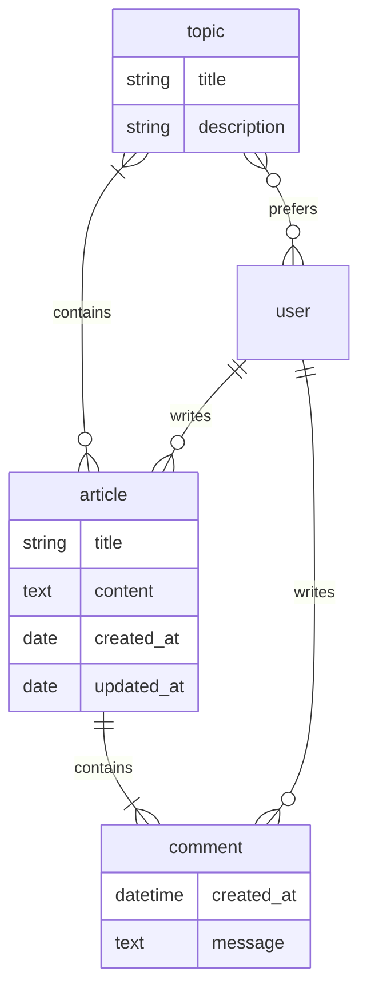

# Blog Site

The project aims to develop a robust and user-friendly web application using
the Django framework. The primary goal is to create a blogging platform that
allows users to publish and manage articles on various topics. The application
will provide an intuitive interface for authors to compose and format their
articles, while also offering a seamless reading experience for visitors.

## Key Features

### User Registration and Authentication

The application will provide user registration and authentication
functionality, allowing individuals to create accounts, log in, and manage
their profile information. This feature will enable authors to have
personalized accounts and maintain ownership of their published articles.

### Article Management

Authors will be able to create, edit, and delete articles within the
application. The system will offer a user-friendly editor. Additionally,
authors will be able to categorize articles by assigning relevant topics to
them.

### Topic Subscription

The application will include a subscription feature that allows users to
subscribe to topics of interest. By subscribing to specific topics, users will
receive notifications or updates whenever new articles are published in those
categories. This feature will enhance user engagement and ensure that readers
stay informed about the topics they find most valuable.

Overall, the project aims to deliver an efficient blogging platform that caters
to both authors and readers. By providing a seamless user experience and
incorporating essential functionalities such as user authentication, article
management, and topic subscriptions, the application will empower users to
create, share, and explore engaging content within a well-structured and
organized platform.

Here is a starter repository template that may help:
[Starter template](https://github.com/devsforge/django-tpl.git).

## Challenge: Functional views

At this stage, route handlers may return placeholder content. The required paths
and HTTP methods must already be available, and each path must have the
described purpose.

Paths use `{name}` for implementation-neutral dynamic parameters.

| Method | Path | Access | Purpose |
| --- | --- | --- | --- |
| `GET` | `/about/` | public | Describe the site and its functionality |
| `GET` | `/` | public | Show the article list |
| `GET` | `/{article}/` | public | Show one article |
| `POST` | `/{article}/comment/` | authenticated | Add a comment to an article |
| `GET`, `POST` | `/create/` | authenticated | Display and submit the article creation form |
| `GET`, `POST` | `/{article}/update/` | author | Display and submit the article update form |
| `GET`, `POST` | `/{article}/delete/` | author | Display and submit article deletion confirmation |
| `GET` | `/topics/` | public | List available topics |
| `POST` | `/topics/{topic}/add/` | authenticated | Add a preferred topic |
| `POST` | `/topics/{topic}/remove/` | authenticated | Remove a preferred topic |
| `POST` | `/topics/{topic}/subscribe/` | authenticated | Enable notifications for a preferred topic |
| `POST` | `/topics/{topic}/unsubscribe/` | authenticated | Disable notifications for a preferred topic |
| `GET` | `/profile/{username}/` | public | Show a user's public profile |
| `GET`, `POST` | `/set-password/` | authenticated | Display and submit password changes |
| `GET`, `POST` | `/set-userdata/` | authenticated | Display and submit profile changes |
| `POST` | `/deactivate/` | authenticated | Deactivate the current account |
| `GET`, `POST` | `/register/` | anonymous | Display and submit registration |
| `GET`, `POST` | `/login/` | anonymous | Display and submit authentication |
| `POST` | `/logout/` | authenticated | End the current authenticated session |

Operations that change persistent state must not be performed by `GET`
requests.

> [!WARNING]
> Optional task(s)
>
> - `GET /archive/{year}/{month}/` lists articles created during the specified
>   month. The year must use four digits. The month range is `1..12` and may
>   include a leading zero. Invalid values return `404 Not Found`.
>
>   Examples:
>
>       /archive/2023/1/
>       /archive/2023/01/
>       /archive/2023/10/

## Challenge: Data models

> [!TIP] 
> Django admin may be used to create some fake data. To gather access to
> an admin section, you need to create a superuser. The easiest way to do that
> is to use a django command:
> 
> ``` shell
> python manage.py createsuperuser
> ```

**General**

- Each model will be registered for the admin site.

**Article topic**

- This is a simple model that contains information about a topic:
    - topic title (unique value, 64 characters or fewer)
    - topic short description (255 characters or fewer)

**Article**

- Article requires title (255 characters or fewer).
- Article requires content (at least 255 characters).
- Creation date should be autogenerated at article creation and would
  never be updated.
- Updated date will be updated at each article saved.

**Article comment**

- Comment requires creation date (autogenerated).
- Comment requires message text.

**Relationships**

> [!NOTE] 
> The standard Django user model **will be** used for now. To apply model
> reference pass `"auth.User"` as a related model. Users can be created via
> admin page. You can also refer to the same model as shown below:
> 
> ``` python
> from django.contrib.auth import get_user_model
> from django.conf import settings
> 
> UserModel = get_user_model()          # option 1
> UserModel = settings.AUTH_USER_MODEL  # option 2
> UserModel = "auth.User"               # option 3
> ```

- `article` and `topics` have *many-to-many* relationship.
- `article` and `user` have *one-to-many* relationship. An article can have *
  *only one** author, but users can create as many articles as they want.
- `article` and `comment` have *one-to-many* relationship. An article may be a
  container for many comments, but a comment is related to a single article.
- `comment` and `user` have *one-to-many* relationship. It's similar to the
  *article-user* relationship.
- `topic` and `user` use *many-to-many* relationship. A single user can prefer
  none or as many topics as needed and vice versa. This relationship represents
  topics preferred by a certain blog user. Also, this provides an additional
  option to mark some of the preferred topics with a **notify** flag to receive
  newsletters about specified topics updates. The difference between *prefer*
  and *notify* is that *preferred* topics affect the article list for a user,
  and *notify* is responsible for newsletters for the user.

**UML diagram**



## Challenge: ORM

Connect the web interface to persistent domain data.

- `GET /` returns the stored article collection.
- `GET /{article}/` returns the requested stored article and its comments.
- `GET /profile/{username}/` returns public profile information and articles
  authored by that user.
- Requests for an article or profile that does not exist return
  `404 Not Found`.
- How queries and business logic are organized in modules, services, classes,
  or functions is an implementation choice.

> [!WARNING]
> Optional task(s)
>
> - Personalize article ordering using the authenticated user's preferred
>   topics while preserving publication recency as the primary ordering rule.

## Challenge: Server-rendered interface

> [!TIP]
> The following Bootstrap-based visual reference may be useful:
> [Bootstrap template](https://github.com/devsforge/css-bootstrap-blog)

The rendering technology and template organization are implementation choices.
The requirements below describe information and navigation visible to users.

**General**

- Pages share a consistent site layout and navigation.
- Every page includes a link to the homepage.
- Every page has a descriptive HTML title ending with `| Blog`, for example
  `Articles | Blog`, `Sample | Blog`, or `Login | Blog`.
- Relevant pages expose the registered topics. Following a topic link filters
  the article list to that topic.
- The about page displays static information describing the site.
- User-controlled content must be escaped or sanitized before it is rendered as
  HTML. Raw unsanitized user-provided HTML must never be injected into a page.

> [!WARNING]
> Optional task(s)
>
> - Relevant pages may include links to archive pages for the last year.
> - Common navigation may include contextual links to `/register/`, `/login/`,
>   and `/create/` according to the current authentication state.

**Article list**

The homepage displays available articles. Each article summary contains:

- article title
- a short content preview, approximately 50 characters
- creation date and time
- up to three related topics
- number of comments

Article summaries should use a consistent presentation, but the mechanism used
to reuse markup or rendering logic is not prescribed.

**Article details**

The article page displays:

- article title
- creation date and time
- author name with a link to the public profile
- related topics
- complete article content
- update and delete actions when the current user is permitted to use them
- related comments

Each comment displays:

- author name
- creation date and time
- message

**Profile page**

A public profile displays:

- username
- first name
- last name
- articles authored by that user

When a user views their own profile, the page also provides access to profile
editing, password change, and account deactivation actions.

**Forms**

- `/register/` collects:
    - username
    - email
    - password
    - password confirmation
- `/login/` collects:
    - username
    - password
- `/create/` and `/{article}/update/` collect:
    - title
    - one or more relevant topics
    - content
- `/{article}/delete/` provides explicit deletion confirmation.
- `/set-password/` collects the new password and its confirmation.
- `/set-userdata/` collects mutable profile information.
- The topic-preferences interface lists available topics and allows the user to
  maintain preferences and notification subscriptions.

Validation errors must be displayed near enough to the relevant form or field
for a user to understand and correct the input.

## Challenge: Articles' slugs

> [!WARNING]
> This is an optional challenge in addition to:
> 
> - [Challenge: Functional views](#challenge-functional-views)
> - [Challenge: Templates](#challenge-templates)
> - [Challenge: Data models](#challenge-data-models)
> - [Challenge: ORM](#challenge-orm)

- Update `Article` model with `slug` field. The slug value is:
    - required for each article
    - unique for each article
- Create a data migration to provide slugs for existing articles.
- `slug` should be auto-generated on article save. The pattern is
  `article.title-article.created_date`, e.g. "Sample article" created
  at "03/24/2023" should receive slug: `sample-article-2023-03-24`.
- Update the detail view URL path with the article slug as a dynamic portion.

## Challenge: Auth forms

Implement registration and login behavior using the forms described by the web
interface contract.

- Registration requires `username`, `email`, `password`, and password
  confirmation.
- A username that is already in use must be rejected.
- Password and password-confirmation values must match.
- Invalid input redisplays the form with actionable validation errors.
- Successful registration redirects the new user to `/login/`.
- Login accepts the user's credentials and establishes authenticated access.

## Challenge: Authentication

The web interface distinguishes anonymous users, authenticated users, resource
authors, and administrators.

| Action | Anonymous | Authenticated user | Author | Administrator |
| --- | --- | --- | --- | --- |
| Read articles, topics, comments, and public profiles | yes | yes | yes | yes |
| Create an article | no | yes | yes | yes |
| Comment on an article | no | yes | yes | yes |
| Edit or delete an article | no | no | yes | yes |
| Edit own profile or password | no | yes | yes | yes |
| Manage own topic preferences | no | yes | yes | yes |

- Anonymous navigation exposes registration and login actions.
- Authenticated navigation exposes logout and article creation actions.
- An anonymous user requesting a protected page is redirected to `/login/`.
  The application should preserve the originally requested destination so the
  user can return to it after successful authentication.
- After login, the user is redirected to that preserved destination when one
  exists; otherwise they are redirected to their profile.
- Article creation records the current authenticated user as the author.
- Comment creation records the current authenticated user as the author.
- Article update and deletion are restricted to the article author.
  Administrators may manage articles through administrative capabilities, but
  no particular administration framework or route is prescribed.
- `/set-password/`, `/set-userdata/`, `/deactivate/`, and topic-preference
  operations are restricted to the current authenticated user.
- Logout ends the current authenticated session and redirects to the homepage.
- Deactivation prevents the user from authenticating again while preserving
  their articles, comments, and referential integrity.

> [!WARNING]
> Optional task(s)
>
> - Adjust article ordering according to authenticated user preferences while
>   keeping the default ordering for anonymous users.
> - Implement account reactivation. The workflow may vary, but it must verify
>   the account owner before restoring authentication access.

## Challenge: Article-related forms

Implement persistent article and comment operations through the server-rendered
web interface.

- Article creation and update use the same set of article fields.
- Every created or updated article has at least one related topic.
- `POST /create/` creates an article owned by the current authenticated user.
- `POST /{article}/update/` updates an article only when the current user is its
  author.
- `POST /{article}/delete/` deletes an article only after explicit confirmation
  and only when the current user is its author.
- `POST /{article}/comment/` creates a comment owned by the current
  authenticated user.
- Anonymous users cannot create, update, or delete articles and cannot create
  comments.
- Invalid submissions preserve user-entered data where practical and display
  validation errors.

## Challenge: Class-Based Views

- Replace **all** existing views via `CBV`.
- Existing functionality should not be corrupted.

> [!NOTE]
> It's ok to use built-in Django CBV if needed.

## Challenge: Serializers

**Article topic**

- Topic serializer is for read-only purposes only. Topics can be created
  via the admin page only.
- Serialized data should contain all available data, e.g. `pk`, `title`,
  `description`.

**Article comment**

- article comment serializer can perform both reading and writing
  operations. But it can't be used to *update* or *delete* comment.
- Random, or pre-defined user may be used as comment's author for now.
  This will be fixed in the future.

**Article**

- article serializer provides full access to articles. All operations
  are available: list, retrieve, create, update, and destroy.

**User**

- User serializer provides full access to site users' data. All
  operations are available for now: list, retrieve, create, update, and
  destroy. This behavior will be fixed in the future to prevent
  unauthorized data modifications.

## Challenge: API views

All blog-site functionality is to be mirrored via REST API.

> [!NOTE]
> It's ok to pass *pre-defined* user as argument in request's body.
> This will be fixed in the next challenge.

## Challenge: Authentication and Permissions

- Implement authentication system for REST API.
    - For non-authenticated users it is possible to create a new account
    - For non-authenticated users it is possible to collect authentication
      data.
- Access to user data is restricted. Authorized users can manipulate
  only their own data (e.g. `retrieve`, `update`).
- Admins can retrieve all user's data (`list`), but can't change them
  via REST API. However, it is still possible via the admin page.
- Authorized users can `create` articles or `update` and `delete`
  articles created by them.
- Authorized users can add comments to a specified article.
- Authorized users can adjust their topic preferences.
